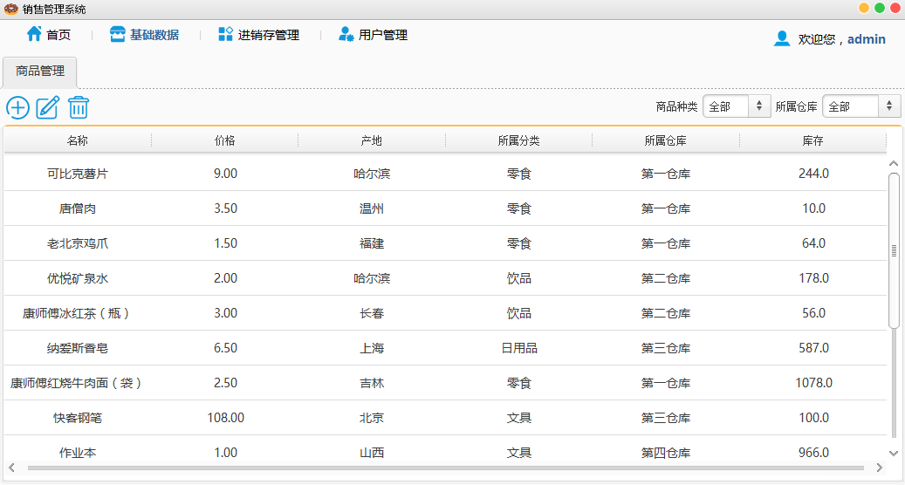
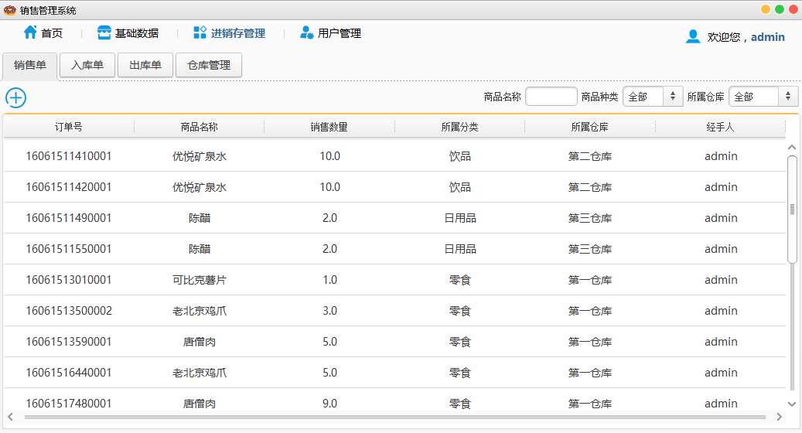
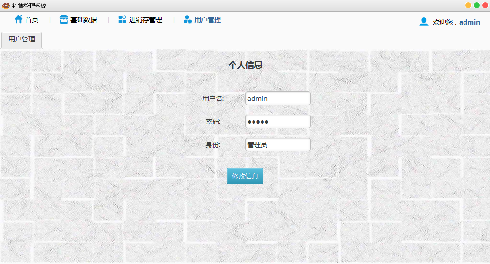

# sale-manage

## 目录说明：

* sale-manage

  工程的源码

* salesmanagement.sql

  数据库 sql 文件（MySQL）

* 设计说明书.doc

  课程设计说明书

## 使用说明：

0. 使用 **Java Swing** 开发

1. 在数据库中运行根目录的 **salesmanagement.sql** 脚本 （默认会创建名为“salesmanagement”的数据库，并导入数据，若默认创建不了，则需手动创建名为“salesmanagement"的数据库，再运行该 SQL 脚本）

2. **myeclipse 10**（用该 IDE 开发，**idea** 也是可以的）导入工程的源码

3. 修改工程源码 src 目录下的 jdbc.properties 文件，username 和 password 改成自己数据库的用户和密码

5. 启动类为 **Entrance**
6. 用户名密码都为 admin

## 运行后界面图：

**首页**

**基础数据**

**进销存管理**

**用户股那里**

## 数据库说明：

根据功能需求分析，要有一个用户表，用户具有 id、姓名、密码、身份标识四个属性，用于登陆系统；

而整个销售管理系统的核心是商品，那么就产生的商品表，商品表拥有 id、姓名、价格、产地、库存、所属仓库、所属分类、删除标识八个属性；

而商品与仓库、分类均为多对一的逻辑关系，那么就产生了仓库表和分类表，仓库表具有 id、名称、删除标识、排序规则四个属性，分类表具有 id、名称、删除标识三个属性；

在销售管理过程中，势必会生成订单，根据功能需求分析，首先要将商品入库，这样就生成了入库单，入库单具有 id、订单号、经手人 id、商品所属仓库 id、商品所属分类 id、入库数量、商品 id、删除标识八个属性；

而在销售中，每有一笔生意，就会生成销售单，需要建立销售表，销售单具有 id、订单号、经手人 id、商品所属仓库 id、商品所属分类 id、销售数量、商品 id、删除标识八个属性；

在商品销售以及库存调动中又会涉及到出库，这样就生成了出库单，出库单具有 id、订单号、经手人 id、商品所属仓库 id、商品所属分类 id、出库数量、商品 id、删除标识八个属性，为了数据交互性能的提升，将入库单与出库单合并产生出入库表，他们各自多了一条属性，即出入库标识。