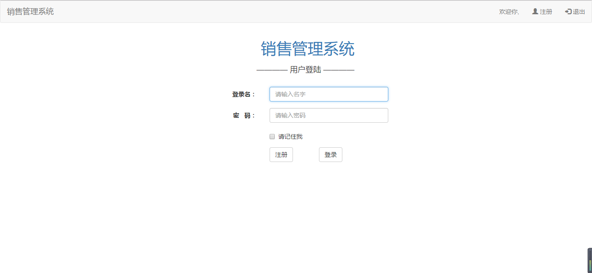
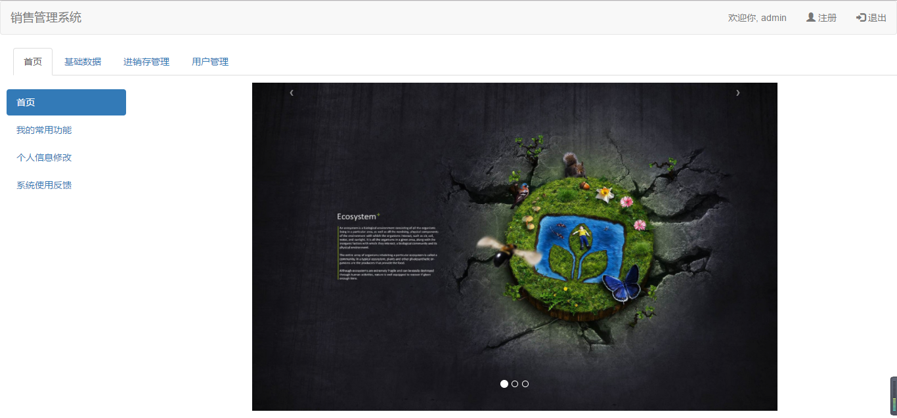
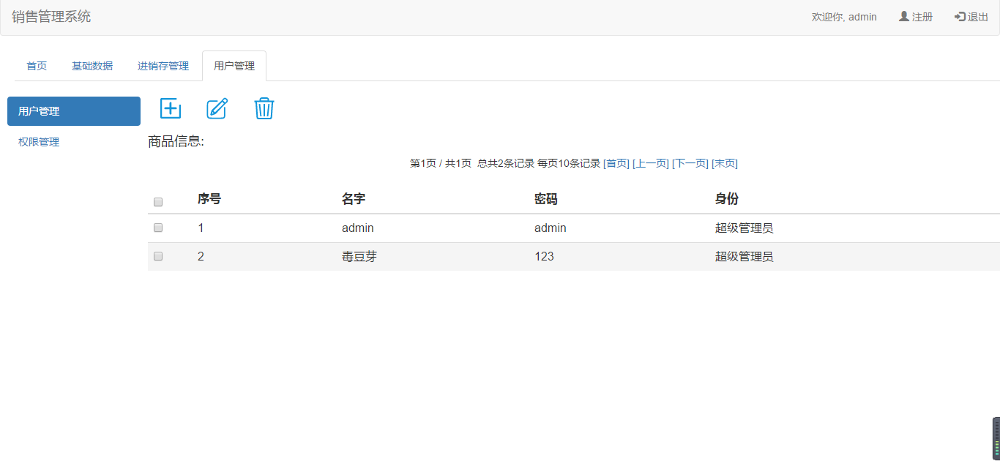

# sale-manage

## 使用说明：

1. 目录说明：
   code.zip -> 源码包

   sale.war -> 项目导出的 war 包（建议 Tomcat7 运行）

   sale -> 源码包解压后目录

   sale.sql -> 数据库脚本

   sale.pdm -> 数据模型

   课程设计文档.docx -> 设计说明书

2. 采用 myeclipse2016CI 开发，如果低版本的编译器导入不成功，请谅解。
3. 请在数据库中创建名为“sale”的数据库，运行项目 Hibernate 会自动建表。
4. 运行 sale.sql 脚本，会灌入数据。

## 运行后界面图：

**登陆界面**

**首页**

**商品页面**

**销售、库存、仓库、分类管理页面**

**用户、权限管理页面**
